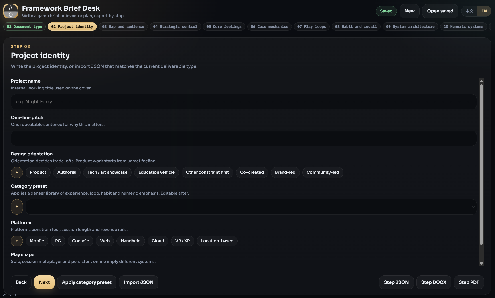

# 框架策划台

**Packed via Axiox Media**

本地步骤向导：把游戏框架策划案或短版商业计划书写成 JSON、DOCX 或 PDF。

  

> [!NOTE]
> Windows 可执行文件未签名，首次运行时 SmartScreen 可能提示。

## 安装

推荐用 [GitHub Deploy Desk](https://github.com/axioxmedia/github-deployer) 一键部署本仓库。本地也可运行 `start.bat`，或执行 `build_exe.bat` 得到 `dist\FrameworkBriefDesk.exe`。

## 功能

- 第一步选择游戏框架策划案或商业计划书
- 步骤条可随时跳转；字段变更自动保存
- 品类预设库；数值五层子步骤可单独导出
- 循环玩法与上瘾/召回单独成步
- 每步与整份均可导出 JSON / DOCX / PDF

## 截图

请将 `APPCap.png` 放到本目录（仓库路径 `docs/APPCap.png`）。
